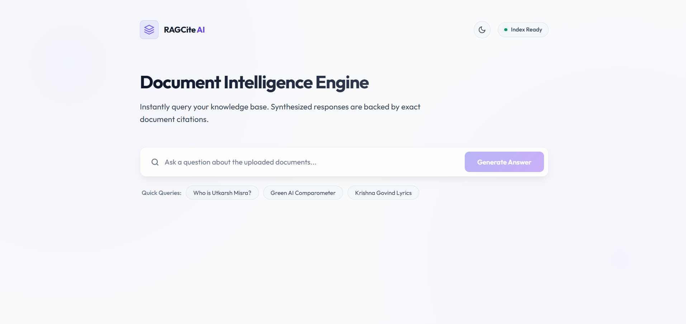

# RAGCite AI — Document Intelligence Engine

RAGCite AI is a professional, high-performance Retrieval-Augmented Generation (RAG) assistant designed to index, search, and synthesize answers from local document libraries. It pairs a robust **FastAPI backend** running LangChain and FAISS with a premium, responsive **Angular frontend** featuring interactive search, source citation lookups, and native Light/Dark theme switching.

---

## 📸 Demo Preview


*Figure 1: RAGCite AI interactive query interface with exact document citations.*

---

## ✨ Features

- **Context-Aware Synthesis**: Utilizes Groq-powered LLMs (`llama-3.1-8b-instant`) to synthesize clear, accurate answers directly derived from document contents.
- **Strict Verification & Citations**: Every generated answer is backed by exact source file tags and page number markers extracted during indexing.
- **MMR Search & Vector Retrieval**: Uses HuggingFace's `all-MiniLM-L6-v2` embeddings with a FAISS vector index and Maximal Marginal Relevance (MMR) retrieval to prevent context redundancy.
- **Dynamic Theme Engine**: Toggle seamlessly between a vibrant Dark Mode and a clean, high-contrast Light Mode.
- **Clean Quick Queries**: Interactive prompt chips for scanning frequently requested document insights instantly.

---

## 🛠️ Tech Stack

### Backend
- **FastAPI**: Fast, asynchronous Web API framework.
- **LangChain**: AI orchestration for document loading, splitting, and LLM prompting.
- **FAISS**: High-speed similarity search index for dense vector retrieval.
- **HuggingFace Embeddings**: Local text vector representation using `sentence-transformers`.
- **Groq Cloud API**: Ultra-fast LLM execution platform.

### Frontend
- **Angular (v17+)**: Component-based application framework.
- **TypeScript**: Typed application logic.
- **Vanilla CSS**: Clean, responsive layout engine with glassmorphic elements and CSS variables.

---

## 📂 Project Structure

```text
rag_tool_assistant/
├── backend/
│   ├── data/
│   │   ├── pdf/               # Source PDF documents
│   │   └── text_files/        # Source TXT documents
│   ├── document_service.py    # Document loading, vector storage, and RAG query pipeline
│   ├── main.py                # FastAPI endpoints and schemas
│   └── requirements.txt       # Python dependencies
├── frontend/
│   ├── src/
│   │   ├── app/
│   │   │   ├── app.component.ts    # Main logic & theme management
│   │   │   ├── app.component.html  # Dashboard UI template
│   │   │   ├── app.component.css   # Responsive styling rules
│   │   │   └── services/
│   │   │       └── rag.service.ts  # HTTP client communication with API
│   │   └── styles.css         # Global themes and CSS custom properties
└── .env                       # API Credentials and environment config
```

---

## 🚀 Getting Started

### Prerequisites
- Python 3.10+
- Node.js (v18+) & npm
- A Groq API Key (get one at the [Groq Console](https://console.groq.com/))

### 1. Environment Configuration
Create a `.env` file in the root folder of the project:
```env
GROQ_API_KEY=gsk_your_actual_groq_api_key_here
```

### 2. Backend Setup
Navigate to the `backend` folder, set up your virtual environment, and start the server:
```bash
cd backend
python -m venv .venv
.venv\Scripts\activate      # On Windows
source .venv/bin/activate    # On Unix/macOS

pip install -r requirements.txt
python -m uvicorn main:app --host 127.0.0.1 --port 8000 --reload
```
The FastAPI documentation will be available at `http://127.0.0.1:8000/docs`.

### 3. Frontend Setup
In a new terminal window, navigate to the `frontend` folder, install dependencies, and run the development server:
```bash
cd frontend
npm install
npm run start
```
Open `http://localhost:4200` in your browser to access the RAGCite AI dashboard.

---

## 📋 License

This project is licensed under the MIT License.
